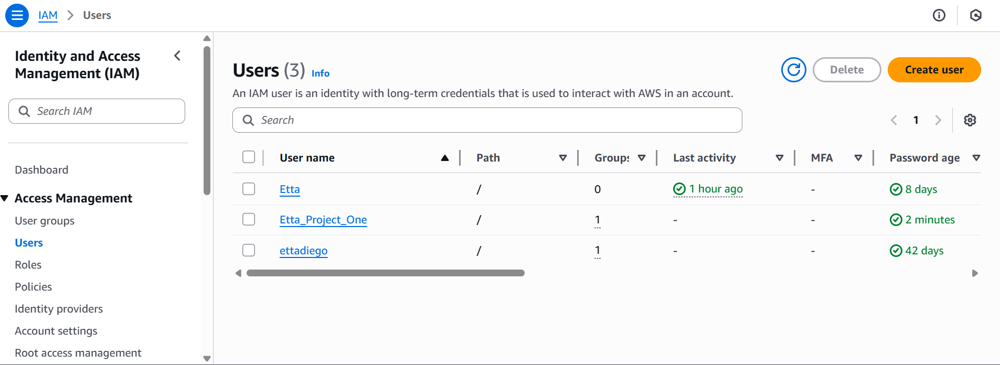
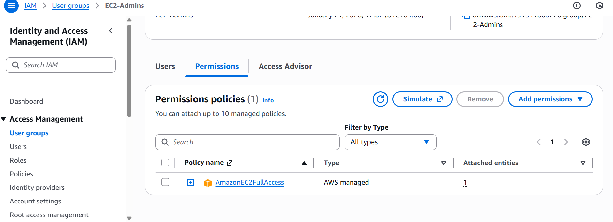
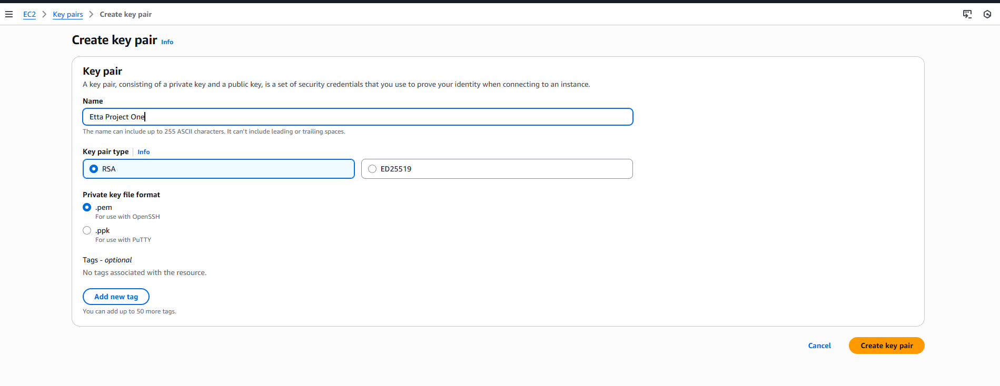
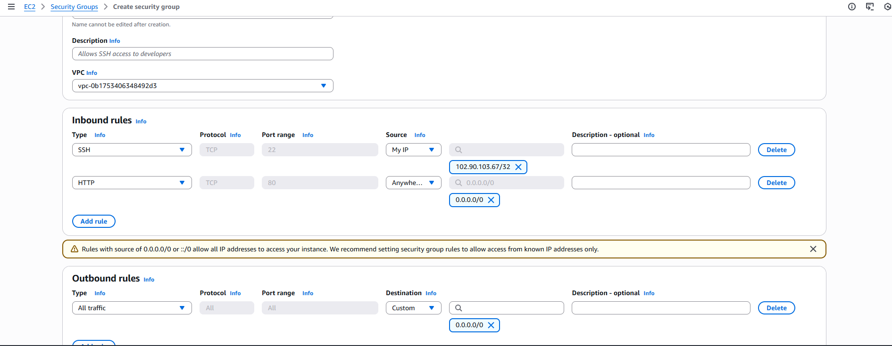
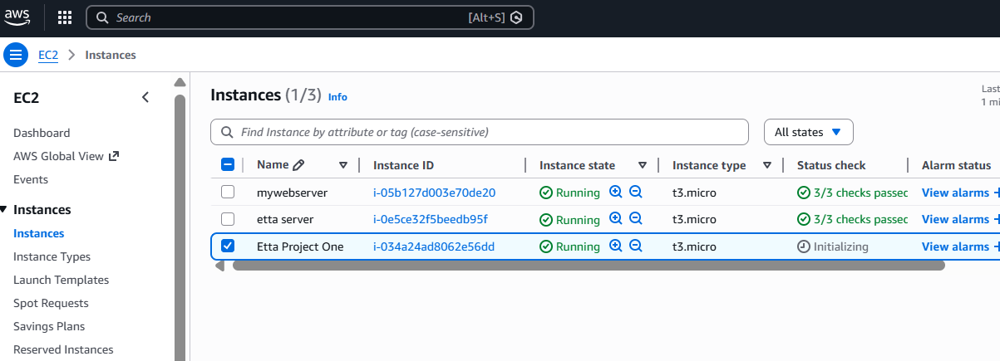
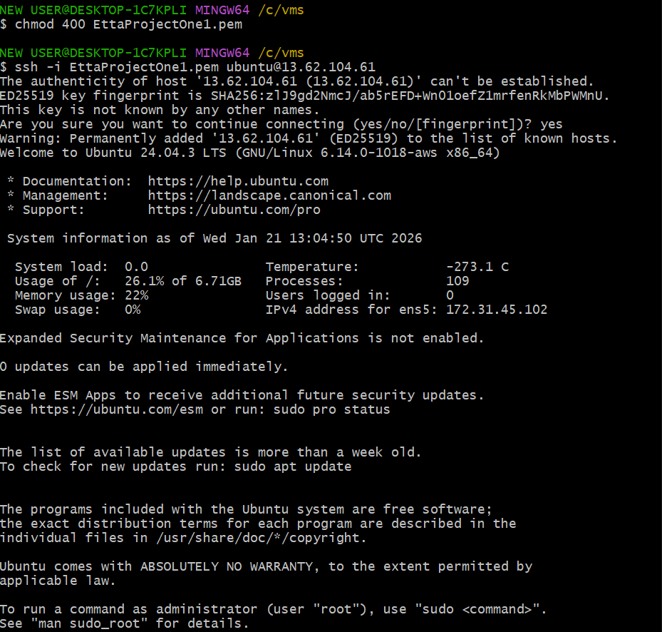
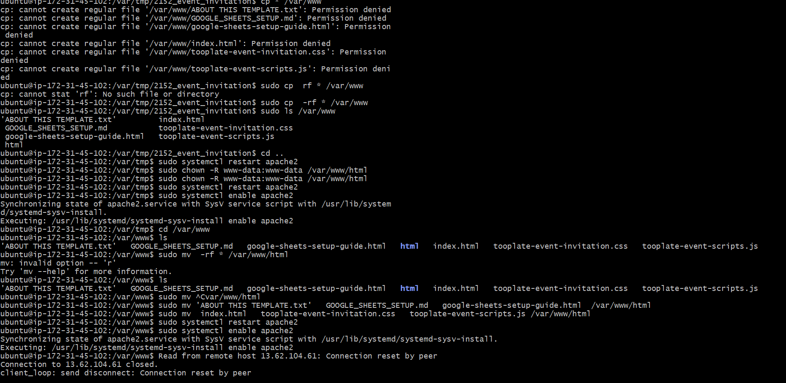
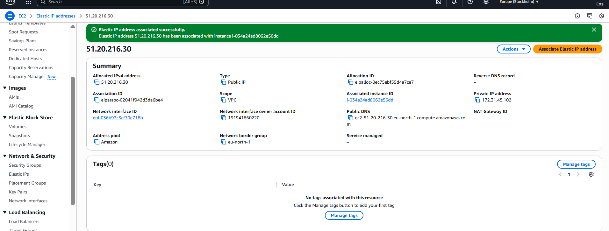
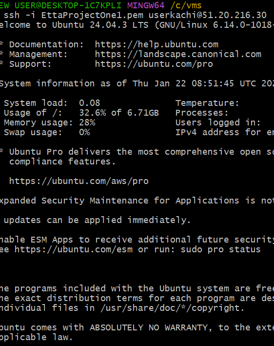
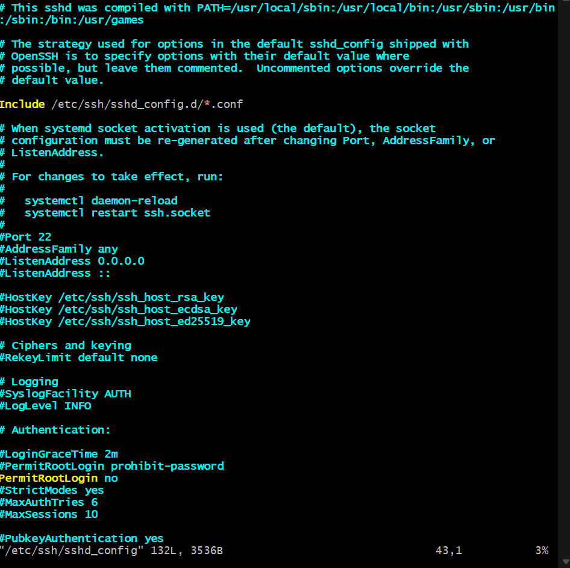

# Secure Deployment of a Production Website on AWS EC2


## Project Overview
This project demonstrates the deployment of a secure, production-ready website on AWS using EC2 and Ubuntu Linux.  
It covers:
- IAM configuration for secure access
- EC2 instance deployment and configuration
- Linux server administration
- Network security via security groups
- Website deployment
- Elastic IP configuration
- Server hardening
- Professional documentation

---


## Repository Contents

- 📁 [screenshots/](screenshots/)
  - Contains task-based screenshots (Task 1–7)
- 📁 [scripts/](scripts/)
  - Contains shell scripts documenting commands used for setup, deployment, and hardening
- 📄 [README.md](README.md)
  - This file: project documentation and explanation


## Architecture
The deployed website uses a single EC2 instance with:
- Ubuntu Server 22.04 LTS
- Apache web server
- Security group with SSH and HTTP access
- Elastic IP for persistent public access
- IAM user group managing EC2 access (no root account usage)

---

## Task 1: IAM Configuration
**Objective:** Create IAM group and user for EC2 administration while ensuring root account is not used.

**Steps:**
1. **Create IAM Group:**  
   - Created a user group named `EC2-Admins` to centralize EC2 management permissions.  
   - Using a group ensures easier scaling and consistent permission management across multiple users.

2. **Attach Managed Policy:**  
   - Attached AWS managed policy `AmazonEC2FullAccess` to the group.  
   - This policy allows full EC2 administrative control, following AWS best practices.

3. **Create IAM User and Assign Group:**  
   - Created a new IAM user named `userkachi`.  
   - Assigned the user to `EC2-Admins` so it inherits all group permissions.  
   - Verified the user can log in via AWS console but not root.

4. **Avoid Root Account:**  
   - The AWS root account was reserved for account-level operations only.  
   - All EC2 operations were performed using the IAM user for better security and accountability.


**Mistakes Made / Notes to Take:**
- Initially tried using the root account to test EC2 access → should **always use IAM user**.  
- Forgot to check group policy propagation before testing → AWS takes a few minutes for permissions to apply.  
- Always double-check group membership for the IAM user before proceeding.


**Screenshots:**
- 
- 

---

## Task 2: Key Pair & Security Configuration
**Objective:** Configure secure access to EC2 instance using key pairs and a least-privilege security group.

**Steps:**
1. **Create EC2 Key Pair:**  
   - Generated an RSA key pair in AWS named `EttaProjectOne1.pem`.  
   - Downloaded the private key and set proper file permissions in Ubuntu (`chmod 400`).  
   - This key is required for secure SSH access to the EC2 instance.

2. **Create Security Group:**  
   - Configured inbound rules:
     - SSH (port 22) → Allowed only from the student’s current public IP.  
     - HTTP (port 80) → Allowed from all IPs (`0.0.0.0/0`).  
   - All other ports were blocked to follow the **least privilege principle**.

3. **Verification:**  
   - Verified that only the specified ports are open using AWS console.


**Mistakes Made / Notes to Take:**
- Initially gave the wrong IP for SSH → connection timed out.  
- Learned to set `chmod 400` on `.pem` file to avoid SSH permission errors.  
- Remember to name the key without spaces; spaces break CLI commands.


**Screenshots:**
- 
- 

---

## Task 3: EC2 Instance Deployment
**Objective:** Deploy a Linux web server instance on AWS with public access.

**Steps:**
1. **Launch EC2 Instance:**  
   - Selected Ubuntu Server 22.04 LTS, t2.micro instance type.  
   - Attached previously created key pair and security group.  
   - Ensured the instance has a public IPv4 address.

2. **Verify Instance Status:**  
   - Confirmed the instance is running and passed all AWS status checks.


**Mistakes Made / Notes to Take:**
- Initially forgot to assign the security group → could not SSH into the instance.
- Double-check public IP before attempting SSH.
- Always select the correct region matching the security group.


**Screenshot:**  


---

## Task 4: Server Access & Configuration
**Objective:** Configure the EC2 instance for hosting a website.

**Steps:**
1. **SSH Access:**  
   - Logged into the EC2 instance using the private key and Ubuntu user.  
   - Verified terminal access.

2. **Update System Packages:**  
    ```bash
   sudo apt update && sudo apt upgrade -y
   ```
   - This ensures the server is running the latest security patches and software.

3.  **Install Web Server (Apache):**
    ```bash
    sudo apt install apache2 -y
    sudo systemctl start apache2
    sudo systemctl enable apache2
    ```
    -  This installs Apache and ensures it starts automatically on boot.

4. Verify Installation:
    - Accessed the EC2 public IP via browser.
    - Confirmed the default Apache web page is displayed.


**Mistakes Made / Notes to Take:**
- Initially tried SSH with .pem in wrong directory → file not found.
- Forgot to open port 80 in security group → browser could not access default page.
- Always verify that the key file has correct permissions (chmod 400).


**Screenshots:**
- 
- 

---

##  Task 5: Website Deployment

**Objective:** Deploy a static website on the EC2 web server.

**Steps:**

1.  **Download Template:**
    - Selected a free HTML template from Tooplate.com.

2.  **Deploy to Web Root:**
    ```bash
    sudo cp -r ~/Downloads/template/* /var/www/html/
    sudo chown -R www-data:www-data /var/www/html
    sudo chmod -R 755 /var/www/html
    ```
- Ensures proper file ownership and permissions.

3.  **Verify Website:**
    - Opened the EC2 public IP in a browser.
    - Confirmed the website is publicly accessible.


**Mistakes Made / Notes to Take:**
- Initially forgot chown → website displayed permission errors.
- Forgetting chmod 755 caused some files not to load correctly.
- Always verify directory ownership and permissions after deployment.


**Screenshots:**
- 
- 

---


##  Task 6: Elastic IP Configuration

**Objective:** Assign a persistent IP to the EC2 instance.

**Steps:**

1.  Allocate Elastic IP in AWS.

2.  Associate Elastic IP with EC2 instance.

3.  Reboot Instance to confirm that the website remains accessible via the Elastic IP.


**Mistakes Made / Notes to Take:**
- Initially did not reboot EC2 → DNS cache caused website not to resolve immediately.
- Ensure Elastic IP is in the same region as your EC2 instance.
- Document the Elastic IP for submission; it does not change after association.


**Screenshots:**
- 
- 

---

##  Task 7: Basic Server Hardening

**Objective:** Improve EC2 server security.

**Steps:**

1.  **Create New User:**
    ```bash
    sudo adduser secureuser
    sudo usermod -aG sudo secureuser
    ```
    - This grants sudo privileges while avoiding use of root account.

2.  **Disable Root SSH Login:**
    - **Edited /etc/ssh/sshd_config:**
    ```text
    PermitRootLogin no
    ```
-   Restarted SSH service.

3. Verify Access:
-   Confirmed login is possible only via the new user and SSH key.


**Mistakes Made / Notes to Take:**
- Initially did not copy SSH key to new user → login failed.
- Always test new user login in a separate terminal before closing the original session.
- Double-check sshd_config syntax; incorrect edits can lock you out.


**Screenshots:**
- 
- 

---


### Commands Used
All commands executed during server configuration and deployment are documented
in the `scripts/` directory for transparency and reproducibility.


##  Security Considerations

- Root account was avoided for all operational tasks.

- Security groups follow least privilege principle.

- Proper file permissions set for website files.

- Key-based SSH authentication is used.

- Server hardening ensures minimal attack surface.


## Submission
- Website is publicly accessible via Elastic IP
- All tasks completed and documented as per project requirements
- GitHub repository link: https://github.com/Etta-Diego/oneWayProjects
